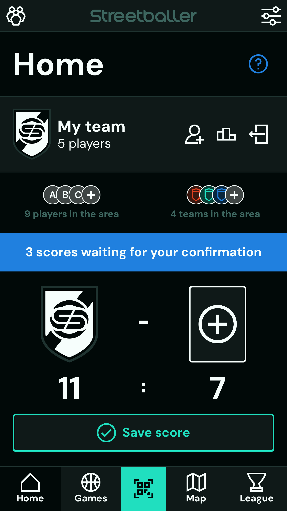
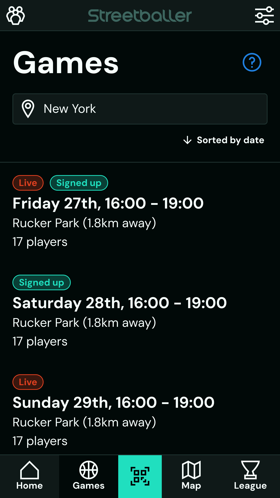
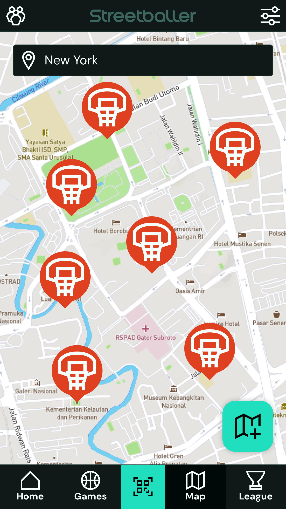
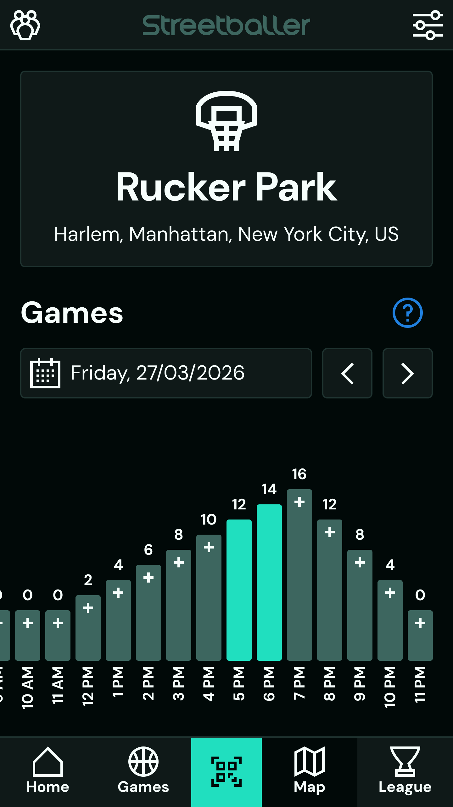
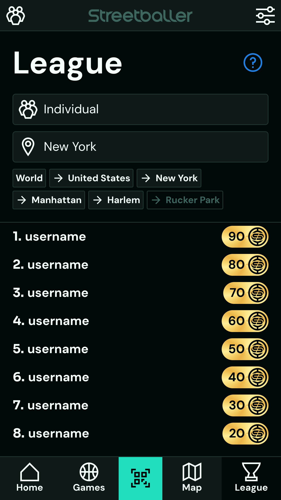
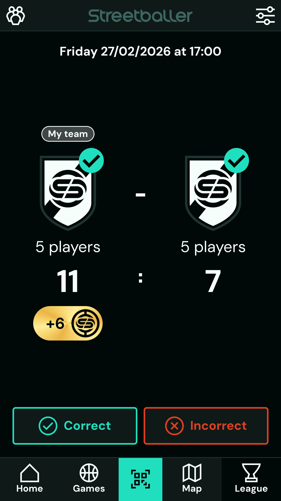
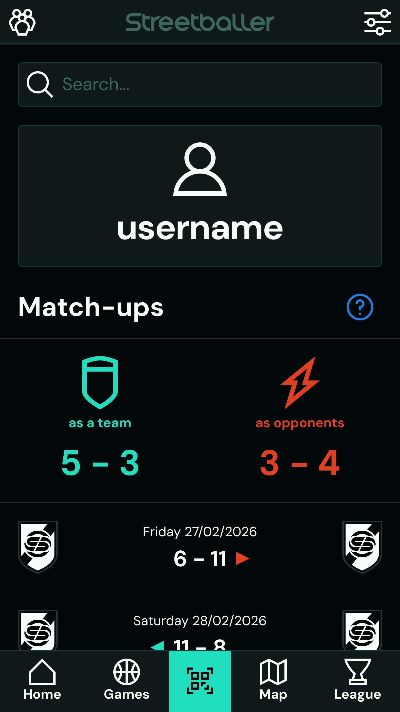
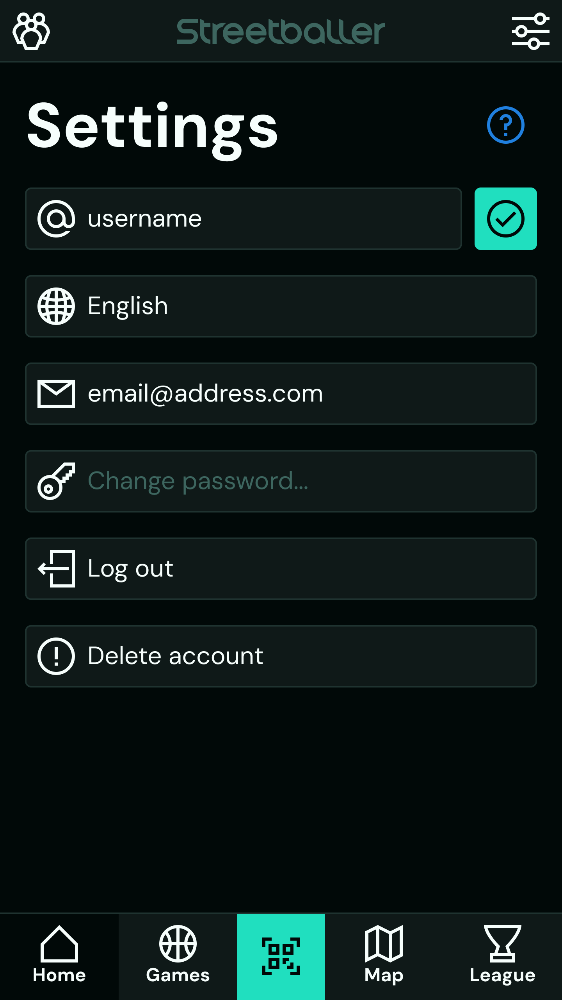
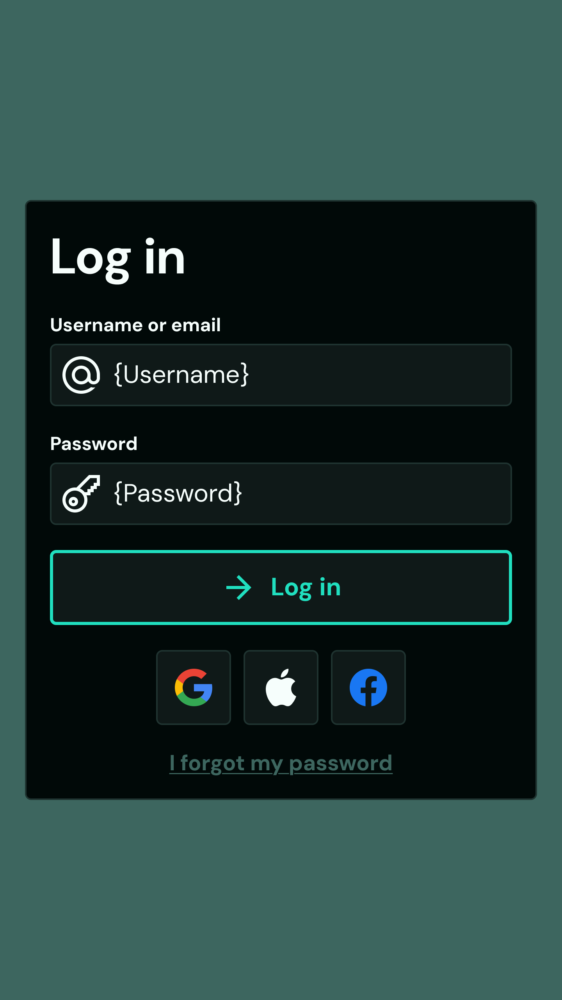

# CLAUDE.md - Streetballer

## Executive Summary

Streetballer is a basketball community app that helps amateur basketball players find courts, organize pick-up games, and compete with others. Basketball players often face a lack of playing opportunities due to poorly connected local basketball communities, sports clubs' structures and schedules that are incompatible with them, and the unrealiable nature of pick-up games. With Streetballer, players can browse a global map of more than 50000 basketball courts, see when other players are playing, sign up to play wherever and whenever it suits them, and gamify the entire playing experience by building their team, recording scores, and earning league points.

## Project Overview

| Route               | Type            | Link to Screenshot                                                | Features                                                                   |
| ------------------- | --------------- | ----------------------------------------------------------------- | -------------------------------------------------------------------------- |
| /home               | Top-level Route |                      | Manage team, See nearby players/teams, Manage recent scores, Record scores |
| /games              | Top-level Route |                    | Find upcoming games                                                        |
| /courts             | Top-level Route |                        | Browse basketball courts, Add missing courts                               |
| /courts/:court_id   | Child Route     |                    | View court details, Find upcoming games, Sign up to play                   |
| /league             | Top-level Route |                  | Follow league rankings                                                     |
| /score              | Child Route     |                    | See score details, Confirm/reject scores                                   |
| /players            | Top-level Route |                  | See own player profile, See scores history                                 |
| /players/:player_id | Child Route     |                  | See player profile, See matchup history                                    |
| /settings           | Top-level Route |              | Manage account settings                                                    |
| /qr                 | Modal Overlay   |                          | Show own QR code, Invite people to Streetballer                            |
| /authentication     | Modal Overlay   |  | Log in, Create account, Reset password                                     |

## Tech Stack

| Layer                 | Technology                               |
| --------------------- | ---------------------------------------- |
| Operating Systems     | Android, iOS, Web                        |
| Design                | Figma                                    |
| Frontend              | Dart, Flutter                            |
| Backend               | Python, FastAPI                          |
| Database              | MongoDB                                  |
| Analytics             | PostHog                                  |
| DevOps                | Google Cloud, Jenkins, Docker, CodeMagic |
| Repository Management | Bazel                                    |

## Folder Structure

- frontend/ (Dart + Flutter Frontend)
  - dist/ (Production Code)
  - infrastructure/ (DevOps-related Files)
  - src/ (Source Code)
    - assets/ (Static Assets)
      - fonts/ (TTF Fonts)
      - icons/ (SVG Icons)
      - images/ (SVG/PNG/JPG Images)
      - locales/ (ARB Localization Files)
    - common/ (Project-scoped Functionality)
      - constants/ (Constant Values)
      - environment/ (Environment Connectors)
      - models/ (Data Models)
      - libraries/ (Wrappers for 3rd Party Libraries)
      - routes/ (Screen Routing)
      - screens/ (Comprehensive Screens)
      - services/ (Core Service Interfaces)
      - widgets/ (Modular Widgets)
      - utilities/ (Simple Utilities)
    - modules/ (Module-scoped Functionality)
      - {module-name}/ (Module Folder)
        - models/ (Data Models)
        - screens/ (Comprehensive Screens)
        - widgets/ (Modular Widgets)
        - logic/ (Business Logic)
    - main.dart (Application Entrypoint)
  - test/ (Test Directory)
    - helpers/ (Testing Helpers)
    - tests/ (Test Files)
- backend/ (Python + FastAPI Backend)
  - dist/ (Production Code)
  - infrastructure/ (DevOps-related Files)
  - seed/ (Seeding Folder)
    - data (Seeding Data)
    - helpers (Seeding Helpers)
    - seeds (Seeding Files)
    - seed.py (Seeding Entrypoint)
  - src/ (Source Code)
    - assets/ (Static Assets)
      - images/ (SVG/PNG/JPG/ICO Images)
      - locales/ (JSON Localization Files)
    - common/ (Project-scoped Functionality)
      - constants/ (Constant Values)
      - controllers/ (High-Level Route Controllers)
      - environment/ (Environment Connectors)
      - middleware/ (Router Middleware)
      - models/ (Data Models)
      - libraries/ (Wrappers for 3rd-party Libraries)
      - logic/ (Business Logic)
      - routes/ (Request Routing)
      - services/ (Core Service Interfaces)
      - utilities/ (Simple Utilities)
    - modules/ (Module-scoped Functionality)
      - {module-name}/ (Module Folder)
        - models/ (Data Models)
        - controllers/ (High-Level Route Controllers)
        - logic/ (Business Logic)
    - main.py (Application Entrypoint)
  - test/ (Testing Folder)
    - helpers (Testing Helpers)
    - tests (Testing Files)
    - test.py (Testing Entrypoint)

## Instructions & Preferences

| Do                                                                           | Don't                                                                        |
| ---------------------------------------------------------------------------- | ---------------------------------------------------------------------------- |
| Short files with a single specific responsibility                            | Complete but long files with multiple responsibilities                       |
| Verbose code that is easy to understand on its own                           | Extensive comments or abbreviated variable names                             |
| Reusable code components (DRY)                                               | Duplicate logic                                                              |
| Repeated and consistent patterns                                             | Individual and case-by-case implementation across files                      |
| One component per purpose with customizable properties for different flavors | Many components per purpose with fixed properties for different flavors      |
| Consistent, straight-forward, junior-friendly patterns                       | Inconsistent or complex coding patterns                                      |
| Monolithic architecture                                                      | Microservices architecture                                                   |
| Performance-optimized code based on official documentation best practices    | Compromising performance for pure developer-friendliness                     |
| Strict type safety                                                           | Loose type flexibility                                                       |
| Simple and targeted libraries                                                | Heavy and mostly unused batteries-included libraries                         |
| Popular, proven, well-documented libraries                                   | Little-known, experimental, outdated libraries                               |
| Provider-agnostic custom library wrappers that expose specific functionality | Direct library calls in multiple places                                      |
| Custom or free-library-assisted implementation of features                   | Paid services and vendor lock-in, unless explicitly discussed                |
| Efficient database indexing, querying, caching                               | Data duplication or inefficient queries in database interactions             |
| Recognizable business logic with separate technical implementation           | Business logic and technical implementation in the same place                |
| Returning null/false/empty values instead of throwing errors where possible  | Throwing errors where a null/false/empty value communicates the same message |
| Error propagation for blocking tasks, error catching for non-blocking tasks  | Unpredictable errors that disrupt user experience or block code execution    |
| Global catch-all error handling as a complement to local error handling      | Full dependence on local error handling                                      |
| Detailed errors for developers, minimal but informative errors for users     | Non-standard and unpredictable error structure                               |
| Dedicated README.md documentation files for each part of the application     | Distributed comments as a means of documentation                             |
| Environment variables managed in a centralized .env file                     | CLI arguments or other methods to set environment variables                  |
| Generous usage of environment variables for flexibility                      | Hard-coding of values that could logically be an environment variable        |
| Localization managed from centralized .arb or .json files                    | Hard-coded text tokens                                                       |
| Pull-to-refresh implementation on all screens                                | Polling or websocket-based data reload                                       |
| Skeleton layout placeholders to reflect loading states                       | Spinner animations to reflect loading states                                 |
| Minimalist toast messages to inform users of updates                         | Silent or obtrusive updates                                                  |
| Ask questions, explain thinking, and propose ideas when in doubt             | Making guesses about decisions not specifically documented                   |

## Libraries

| Purpose               | Layer    | Libraries                   |
| --------------------- | -------- | --------------------------- |
| State Management      | Frontend | flutter_riverpod            |
| Dependency Injection  | Frontend | flutter_riverpod            |
| Navigation            | Frontend | go_router                   |
| Local Storage         | Frontend | flutter_secure_storage      |
| HTTP Client           | Frontend | http                        |
| Localization          | Frontend | intl, flutter_localizations |
| Maps                  | Frontend | google_maps_flutter         |
| Geolocation           | Frontend | geolocator                  |
| SVG Images            | Frontend | flutter_svg                 |
| QR Codes              | Frontend | mobile_scanner, qr_flutter  |
| Environment Variables | Frontend | envied                      |
| Testing               | Frontend | test                        |
| Package Manager       | Backend  | uv                          |
| Database Driver       | Backend  | pymongo                     |
| Credential Hashing    | Backend  | argon2-cffi                 |
| Cron Jobs             | Backend  | python-crontab              |
| Environment Variables | Backend  | python-dotenv               |
| Email Driver          | Backend  | smtplib                     |
| Authentication        | Backend  | pyjwt                       |
| Testing               | Backend  | pytest                      |

## Detailed Documentation

Detailed requirements are documented in the .claude/ folder and structured as follows:

- models.md documents the data structures and business logic: This file governs the project-specific data models and rules
- views.md documents the user interface and design guidelines: This file along with the referenced screenshots govern the UI/UX design
- controllers.md documents the API specification and technical implementation: This file governs the backend API
- The subfolders in the .claude/ folder contains further assets that you may need to reference

## Cooperation Process

Cooperation is based on the Double Diamond framework by the British Design Council. Sessions should generally reflect the steps outlined below. You have the freedom to use your judgement to shorten, skip, or merge steps when a given task allows it for the sake of token usage optimization.

1. Discover (done when you have enough information): Based on a one-line goal description, ask questions and browse documentation to explore and understand the context.
2. Define (done when consensus is reached): Narrow the information down to the specific requirements, methods, and expected output of the session.
3. Develop (done when all tests pass): Execute the defined tasks and run tests.
4. Deliver (done when changes are committed to source control): Implement feedback, document the session, and commit to source control with an informative message.

## Further Guidelines

- Authentication: Authentication follows a lazy login pattern where authentication is only required for features that either A) read data that is specific to the requester or B) write data to the database. Everything else (i.e. pure anonymous GET requests) is freely available. The leading principle is to reduce friction for the user as much as possible.
- Testing: Follow a test-driven development approach and work in red/green/refactor cycles. Testing should be rigorous but only test top-level logic, which encompasses route controllers and middleware on the backend and screens on the frontend. Elegant error handling should make errors easy to trace back from the top level. Do not bother with vanity metrics such as code coverage.
- Localization: Streetballer supports English (default) and Spanish, with more languages to be added later. Never hard-code localized text, always manage text tokens in single-source-of-truth locale files.
- Security: Adhere to OAuth2 best practices and take a silent security over a blocking security approach. Above a robust and sufficient level of security, excellent user experience always has priority over additional potentially annoying security measures. Security should be treated as a matter of "as-little-as-necessary" rather than "as-much-as-possible".
- DevOps: Agile CI/CD is a critical success metric to continuously develop Streetballer. Write and maintain the files required for the entire DevOps pipeline in the dedicated folders.

## Claude Code Comments (Managed by Claude Code)

This section documents further additions to CLAUDE.md that Claude Code deems sensible. At the end of every session, update the Project Status, Commands, and Notes sections autonomously and commit changes to source control with an informative commit message. Make sure CLAUDE.md never exceeds 300 lines, and if it starts to approach that limit, prune the Notes section first to remove outdated and unnecessary lines.

### Project Status

| Task                     | Comments                                                                                  |
| ------------------------ | ----------------------------------------------------------------------------------------- |
| Last Completed Task      | Auth infrastructure (JWT library, hash library, auth middleware, token rotation endpoint) |
| Current Task             |                                                                                           |
| Next Task                | Authentication endpoints (log-in, sign-up, password reset)                                |
| Current Blocking Factors |                                                                                           |

### Commands

| Command                                                          | Task                 |
| ---------------------------------------------------------------- | -------------------- |
| `cd backend && uv run uvicorn src.main:app --port 3000 --reload` | Start dev server     |
| `cd backend && uv run pytest test/tests/ -v`                     | Run tests            |
| `cd backend && uv sync --dev`                                    | Install dependencies |

### Notes

- Backend lives in `backend/`, run all commands from that directory
- uv creates a `.venv` — IDE may show false "not installed" hints for system Python
- `.env` is gitignored; use `.env.example` as the template
