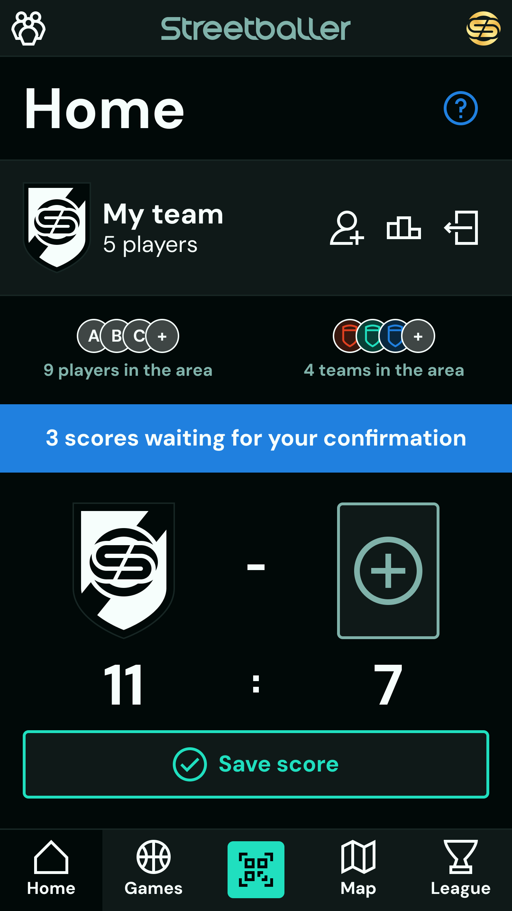
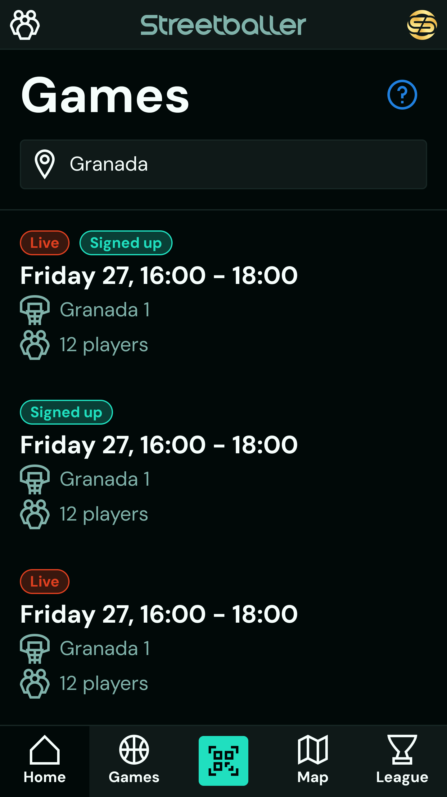
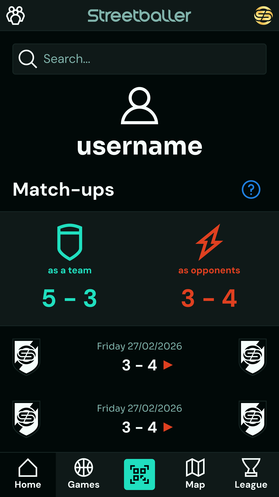
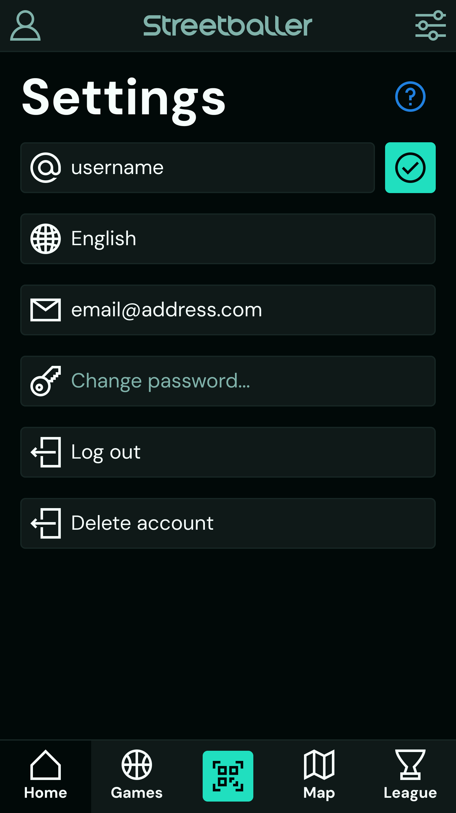

# CLAUDE.md - Streetballer

---

## Project Description

Streetballer is a basketball community app that helps amateur basketball players find courts, organize pick-up games, and compete with other players. Basketball players often face a lack of playing opportunities due to poorly connected local basketball communities, sports clubs' structures and schedules that are incompatible with them, and the unrealiable nature of pick-up games. With Streetballer, players can browse a global map of more than 50000 basketball courts, see when other players are playing, sign up to play wherever and whenever it suits them, and gamify the entire playing experience by building their team, recording scores, and earning league points.

---

## Tech Stack

| Layer                    | Technology                               |
| ------------------------ | ---------------------------------------- |
| Target Operating Systems | Android, iOS                             |
| Design                   | Figma                                    |
| Frontend                 | Dart, Flutter                            |
| Backend                  | Python, FastAPI                          |
| Database                 | MongoDB                                  |
| Analytics                | PostHog                                  |
| DevOps                   | Google Cloud, Jenkins, Docker, CodeMagic |
| Repository Management    | Bazel                                    |

---

## Folder Structure

- frontend/ (Dart + Flutter Frontend)
  - dist/ (Production Code)
  - infrastructure/ (Complementary DevOps Pipeline Files)
  - src/ (Source Code)
    - assets/ (Static Assets)
      - fonts/ (TTF Fonts)
      - icons/ (SVG Icons)
      - images/ (SVG/PNG/JPG Images)
      - locales/ (ARB Localization Files)
    - common/ (Project-scoped Functionality)
      - constants/ (Constant Values)
      - environment/ (Environment Connectors)
      - models/ (Data Models)
      - libraries/ (Wrappers for 3rd Party Libraries)
      - routes/ (Screen Routing)
      - screens/ (Comprehensive Screens)
      - services/ (Core Service Interfaces)
      - widgets/ (Modular Widgets)
      - utilities/ (Simple Utilities)
    - modules/ (Module-scoped Functionality)
      - {module-name}/ (Module Folder)
        - models/ (Data Models)
        - screens/ (Comprehensive Screens)
        - widgets/ (Modular Widgets)
        - logic/ (Business Logic)
    - main.dart (Application Entrypoint)
  - test/ (Test Directory)
    - helpers/ (Testing Helpers)
    - tests/ (Test Files)
- backend/ (Python + FastAPI Backend)
  - src/ (Source Code)
    - assets/ (Static Assets)
      - images/ (SVG/PNG/JPG/ICO Images)
      - locales/ (JSON Localization Files)
    - common/ (Project-scoped Functionality)
      - constants/ (Constant Values)
      - controllers/ (High-Level Route Controllers)
      - environment/ (Environment Connectors)
      - middleware/ (Router Middleware)
      - models/ (Data Models)
      - libraries/ (Wrappers for 3rd-party Libraries)
      - logic/ (Business Logic)
      - routes/ (Request Routing)
      - services/ (Core Service Interfaces)
      - utilities/ (Simple Utilities)
    - modules/ (Module-scoped Functionality)
      - {module-name}/ (Module Folder)
        - models/ (Data Models)
        - controllers/ (High-Level Route Controllers)
        - logic/ (Business Logic)
    - main.py (Application Entrypoint)
  - seed (Seeding Folder)
    - data (Seeding Data)
    - helpers (Seeding Helpers)
    - seeds (Seeding Files)
    - seed.py (Seeding Entrypoint)
  - test (Testing Folder)
    - helpers (Testing Helpers)
    - tests (Testing Files)
    - test.py (Testing Entrypoint)
  - dist (Production Code)
  - infrastructure/ (Complementary DevOps Pipeline Files)

---

## App Overview

| Screen                                                                  | Features                                                                   |
| ----------------------------------------------------------------------- | -------------------------------------------------------------------------- |
|                            | Manage team, See nearby players/teams, Manage recent scores, Record scores |
|                          | Find upcoming games                                                        |
|                              | Browse basketball court map, Add missing courts                            |
|                          | View court details, Find upcoming games, Sign up to play                   |
|                          | See score details, Confirm/reject scores                                   |
|                        | Follow league rankings                                                     |
|                        | See player profile, See matchup history                                    |
|                    | Manage account settings                                                    |
|                | Scan QR codes, Show own QR code                                            |
|            | Scan QR codes, Show own QR code                                            |
|  | Log in, Create account, Reset password                                     |
|      | Invite players to Streetballer                                             |

---

## Coding Preferences

| Do                                                                           | Don't                                                                        |
| ---------------------------------------------------------------------------- | ---------------------------------------------------------------------------- |
| Short files with a single specific responsibility                            | Complete but long files with multple responsibilities                        |
| Verbose code that is easy to understand on its own                           | Extensive comments or abbreviated variable names                             |
| Consistent, straight-forward, junior-friendly patterns                       | Inconsistent or complex coding patterns                                      |
| Monolithic architecture                                                      | Microservices architecture                                                   |
| Strict type safety                                                           | Loose type flexibility                                                       |
| Simple and targeted libraries                                                | Heavy batteries-included libraries where 90% of the library isn't used       |
| Popular, proven, well-documented libraries                                   | Little-known, experimental, outdated libraries                               |
| Efficient database indexing, querying, caching                               | Data duplication or inefficient queries in database interactions             |
| Recognizable business logic with separate technical implementation           | Business logic and technical implementation in the same place                |
| Provider-agnostic custom library wrappers that expose specific functionality | Direct library calls in many different places                                |
| Custom or free-library-assisted implementation of features                   | Paid services and vendor lock-in, unless explicitly discussed                |
| Returning null/false/empty values instead of throwing errors where possible  | Throwing errors where a null/false/empty value communicates the same message |
| Error propagation for blocking tasks, error catching for non-blocking tasks  | Unpredictable errors that disrupt user experience or block code execution    |
| Global catch-all error handling as a complement to local error handling      | Full dependence on local error handling                                      |
| Detailed errors for developers, minimal but informative errors for users     | Non-standard and unpredictable error structure                               |
| Detailed README.md documentation for each application                        | Distributed comments as a means of documentation                             |
| Environment variables managed in a centralized .env file                     | CLI arguments or other methods to set environment variables                  |
| Localization managed from centralized .arb or .json files                    | Hard-coded text tokens                                                       |

---

## Libraries

| Purpose               | Layer    | Libraries                   |
| --------------------- | -------- | --------------------------- |
| State Management      | Frontend | flutter_riverpod            |
| Dependency Injection  | Frontend | flutter_riverpod            |
| Navigation            | Frontend | go_router                   |
| Local Storage         | Frontend | flutter_secure_storage      |
| HTTP Client           | Frontend | http                        |
| Localization          | Frontend | intl, flutter_localizations |
| Maps                  | Frontend | google_maps_flutter         |
| Geolocation           | Frontend | geolocator                  |
| SVG Images            | Frontend | flutter_svg                 |
| QR Codes              | Frontend | mobile_scanner, qr_flutter  |
| Environment Variables | Frontend | envied                      |
| Testing               | Frontend | test                        |
| Package Manager       | Backend  | uv                          |
| Database Driver       | Backend  | pymongo                     |
| Credential Hashing    | Backend  | argon2-cffi                 |
| Cron Jobs             | Backend  | python-crontab              |
| Environment Variables | Backend  | python-dotenv               |
| Email Driver          | Backend  | smtplib                     |
| Authentication        | Backend  | pyjwt                       |
| Testing               | Backend  | pytest                      |

---

## UI/UX Design

All design guidelines are defined in the .claude/design/ folder, which includes theme data, font files, visual assets, and anything else related to the app's design.

---

## Data Models

Data models are defined in the .claude/models/ folder as JSON schemas. All relevant business logic is explained in the model field descriptions.

---

## API Endpoints

The backend is built as a REST API

### Protocol

REST API

### Base URL

- Development: [http://localhost:3000](http://localhost:3000)
- Production: [https://api.streetballer.app](https://api.streetballer.app)

### Authentication & Authorization

- Authentication Mechanism: Bearer Token (Access Token + Refresh Token)
- Supported Authentication Flows: User + Password, Google, Apple, Facebook

### Response Format

All responses, whether successful or failed with an error, should follow the same structure:

```json
{
  "status": "HTTP Status Code",
  "message": "Text Description",
  "data": "JSON Object"
}
```

### Error Codes

- 400: All endpoints with a non-empty request query/body can return a 400 error and should validate user input
- 401: Only the endpoints that can return a 401 error require authentication
- 403: Only the endpoints that can return a 403 error need to check if the requester has read/write authorization for the requested resource
- 404: Only the endpoints that can return a 404 error need to check if the requested resource exists
- 409: Only the endpoints that can return a 409 error need to check if the user input conflicts with existing data
- 500: All endpoints can and should return a 500 error if anything fails on the server side, without exposing details to the user

### Endpoints

| Endpoint                         | Description                | Request Query/Body                                       | Response                                        | Errors        |
| -------------------------------- | -------------------------- | -------------------------------------------------------- | ----------------------------------------------- | ------------- |
| GET /health-check                | Check Backend Availability | {}                                                       | {}                                              |               |
| POST /auth/log-in                | Log in with User/Social    | { user, password } OR { token, method }                  | { access_token, refresh_token }                 | 401, 498      |
| POST /auth/sign-up               | Sign up                    | { email, username, password } OR { token, method }       | { access_token, refresh_token }                 | 409           |
| POST /auth/reset-password        | Request Password Reset     | { user }                                                 | {}                                              |               |
| POST /auth/reset-password/:token | Reset Password             | { new_password }                                         | {}                                              | 498           |
| POST /auth/verify-account/:token | Verify Account             | {}                                                       | {}                                              | 498           |
| POST /auth/refresh/:token        | Rotate Tokens              | {}                                                       | { access_token, refresh_token }                 | 498           |
| GET /players                     | Search Players             | { longitude, latitude, text_search }                     | { players }                                     |               |
| GET /players/player              | Get Own Players            | {}                                                       | { player }                                      | 401           |
| GET /players/:player_id          | Get Player                 | {}                                                       | { player }                                      | 404           |
| GET /players/:player_id/record   | Get Record with Player     | {}                                                       | { with: { won, lost }, against: { won, lost } } | 401, 404      |
| GET /places                      | Search Places              | { longitude, latitude, text_search }                     | { places }                                      |               |
| GET /courts                      | Search Courts              | { longitude, latitude }                                  | { courts }                                      |               |
| POST /courts                     | Add Court                  | { longitude, latitude, name }                            | { court }                                       | 401, 409      |
| GET /courts/:court_id            | Get Court                  | {}                                                       | { court }                                       | 404           |
| GET /games                       | Search Games               | { court_id, from_date, to_date, longitude, latitude }    | { games, courts }                               |               |
| POST /games                      | Create Game                | { court_id, date }                                       | {}                                              | 401           |
| POST /games/:game_id/join        | Join Game                  | {}                                                       | {}                                              | 401, 404      |
| GET /teams                       | Search Teams               | { geolocation }                                          | { teams }                                       |               |
| POST /teams                      | Create Team                | { player_id }                                            | { team }                                        | 401, 404      |
| GET /teams/team                  | Get Own Team               | {}                                                       | { team, players }                               | 401, 404      |
| POST /teams/team                 | Edit Own Team              | { color, add_player_ids, remove_player_ids }             | {}                                              | 401, 404      |
| GET /teams/standings             | Get Current Game Standings | {}                                                       | { teams, players, scores }                      | 401, 404      |
| GET /teams/:team_id              | Get Team                   | {}                                                       | { team, players }                               | 401, 404      |
| GET /scores                      | Search Scores              | { player_id, from_date, to_date, confirmed }             | { scores }                                      | 401           |
| POST /scores                     | Submit Score               | { score_1, score_2, team_1, team_2, player_1, player_2 } | { score }                                       | 401           |
| GET /scores/:score_id            | Get Score                  | {}                                                       | { score, players }                              | 404           |
| POST /scores/:score_id/confirm   | Confirm Score              | {}                                                       | {}                                              | 401, 403, 404 |
| POST /scores/:score_id/reject    | Reject Score               | {}                                                       | {}                                              | 401, 403, 404 |
| GET /league                      | Get League Standings       | { place_id, court_id, team_size }                        | {}                                              | 404           |
| GET /settings/username           | Edit Username              | { username }                                             | {}                                              | 401, 409      |
| GET /settings/email              | Edit Email                 | { email }                                                | {}                                              | 401, 409      |
| GET /settings/password           | Edit Password              | { old_password, new_password }                           | {}                                              | 401           |
| GET /settings/language           | Edit Language              | { language }                                             | {}                                              | 401           |
| GET /settings/delete-account     | Request Account Deletion   | { message }                                              | {}                                              | 401           |

---

## Testing

Follow a TDD philosophy, developing code in systematic red/green/refactor cycles. Keep test code separate from source code as specified in the folder structure. Run both unit and integration tests

## Localization

Streetballer supports English and Spanish, with more languages to be added later. Never hard-code localized text, always take text tokens from centrally managed locale files.

## DevOps

Streetballer will be deployed as a mobile app on iOS and Android. The backend will run as a Docker container on a Google Cloud VM. All CI/CD flows will be managed via a Jenkins server. Write and maintain the scripts and files required for the entire DevOps pipeline.

## Security

Follow OAuth2 best practices and a silent rather than blocking security philosophy. Once a basic level of robust and sufficient security is established, excellent user experience always has priority over additional potentially annoying security measures.
